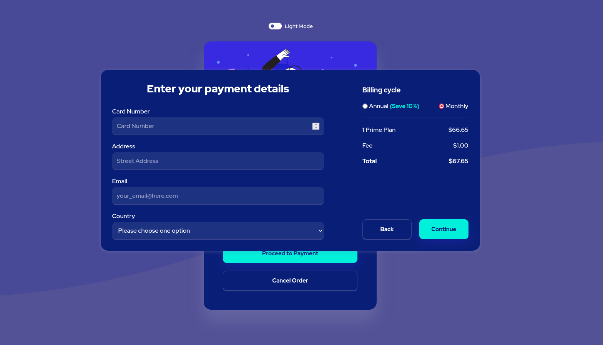
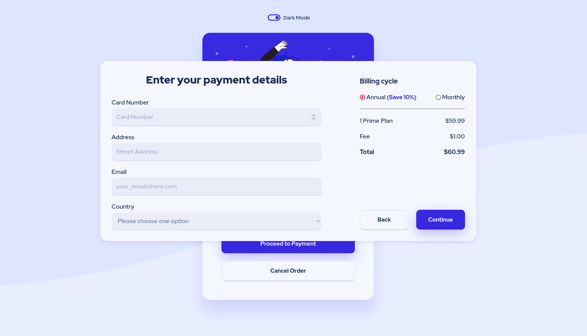
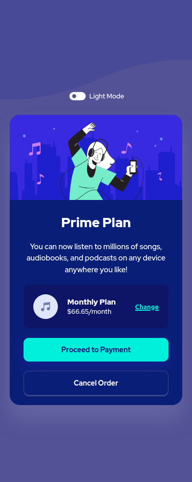
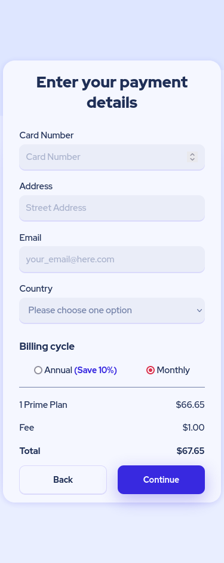
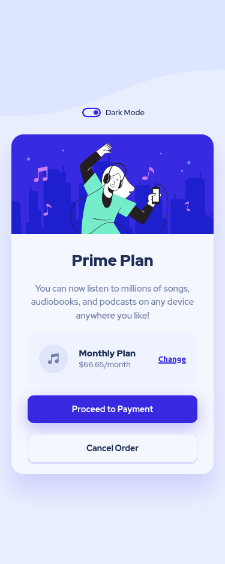
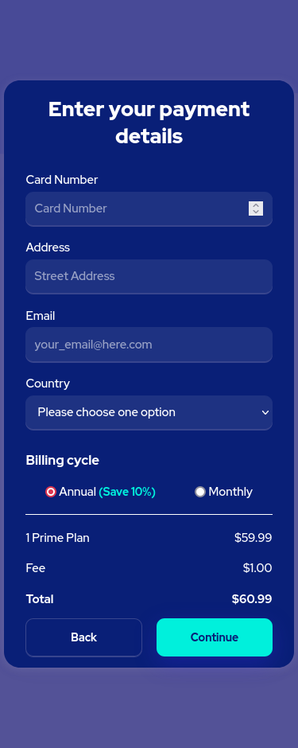

# Frontend Mentor - Order summary card solution

This is a solution to the [Order summary card challenge on Frontend Mentor](https://www.frontendmentor.io/challenges/order-summary-component-QlPmajDUj). Frontend Mentor challenges help you improve your coding skills by building realistic projects.

Since I am learning Javascript, I created some features to practice my knowledge

## Table of contents

- [Overview](#overview)
  - [The challenge](#the-challenge)
  - [Screenshot](#screenshot)
  - [Links](#links)
- [Author](#author)
- [Acknowledgments](#acknowledgments)

## Overview

### The challenge

Users should be able to:

- See hover states for interactive elements

My personal improvements to the Frontend Mentor challenge:

- Change between dark and light mode
- Interact with the 'Change' button on the card to change the type of the plan (Annual Plan or Monthly Plan) and therefore see its price
  -Click on the 'Proceed to Payment' button and go to a checkout popUp where the user could enter their details and change the Billing cycle
  -Go back to the card by the 'Back' button

### Screenshot

### Links

- Solution URL: [https://www.frontendmentor.io/solutions/responsive-card-and-checkout-popup-with-vanilla-javascriptcss-\_yZx3Wpd_s](https://www.frontendmentor.io/solutions/responsive-card-and-checkout-popup-with-vanilla-javascriptcss-_yZx3Wpd_s)
- Live Site URL: [https://ckorder-summary-component.netlify.app](https://ckorder-summary-component.netlify.app)

## My process

### Built with

- Semantic HTML5 markup
- CSS custom properties
- Flexbox
- CSS Grid
- Desktop-first workflow
  -Vanilla Javascript

## Author

- Website - [ck-order-summary-component](https://ckorder-summary-component.netlify.app)
- Frontend Mentor - [@cristinakellyt](https://www.frontendmentor.io/profile/cristinakellyt)
- Twitter - [@yourusername](https://www.twitter.com/yourusername)

## Acknowledgments

I am thankful to @joseigor who helped me sometimes when I got stuck with Javascript, since this is my first project using this language.

Also, the dark/light mode I saw in a solution from @correlucas and I thought it very nice, so I wanted to try it too, by the way, his projects are very creative, something that I want to improve on my ones!
